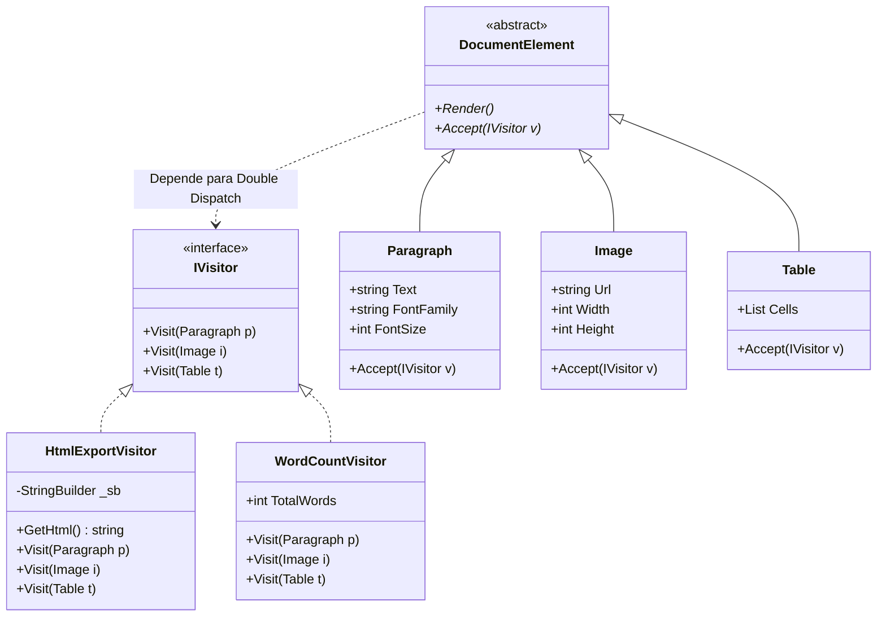

## 🥁 CarnaCode 2026 - Desafio 23 - Visitor

Oi, eu sou o Ronaldo e este é o espaço onde compartilho minha jornada de aprendizado durante o desafio **CarnaCode 2026**, realizado pelo [balta.io](https://balta.io). 👻

Aqui você vai encontrar projetos, exercícios e códigos que estou desenvolvendo durante o desafio. O objetivo é colocar a mão na massa, testar ideias e registrar minha evolução no mundo da tecnologia.

### Sobre este desafio
No desafio **Visitor** eu tive que resolver um problema real implementando o **Design Pattern** em questão.
Neste processo eu aprendi:
* ✅ Boas Práticas de Software
* ✅ Código Limpo
* ✅ SOLID
* ✅ Design Patterns (Padrões de Projeto)

## Problema
Um sistema de documentos tem diferentes tipos de elementos (Parágrafo, Imagem, Tabela) e precisa realizar múltiplas operações (exportar HTML, PDF, contar palavras, validar). 
O código atual adiciona cada operação como método em cada classe, violando Open/Closed Principle.

## Sobre o CarnaCode 2026
O desafio **CarnaCode 2026** consiste em implementar todos os 23 padrões de projeto (Design Patterns) em cenários reais. Durante os 23 desafios desta jornada, os participantes são submetidos ao aprendizado e prática na idetinficação de códigos não escaláveis e na solução de problemas utilizando padrões de mercado.

### eBook - Fundamentos dos Design Patterns
Minha principal fonte de conhecimento durante o desafio foi o eBook gratuito [Fundamentos dos Design Patterns](https://lp.balta.io/ebook-fundamentos-design-patterns).

### Veja meu progresso no desafio
[Repositório central](https://github.com/ronaldofas/balta-desafio-carnacode-2026-central)

---

# 🚀 Minha Implementação da Refatoração (Visitor Pattern)

Para resolver os problemas de design deste projeto, apliquei o padrão **Visitor**. Abaixo, detalho como estruturei a solução e os conceitos que guiaram meu trabalho.

## 🧠 Entendendo o Padrão Visitor

O **Visitor** é um padrão de projeto comportamental que permite separar algoritmos dos objetos nos quais eles operam. No contexto deste desafio, a estrutura de dados (Parágrafo, Imagem e Tabela) era relativamente estável, mas a necessidade de novas operações era frequente.

### Por que usei este padrão?
1.  **Open/Closed Principle**: Consegui adicionar novas funcionalidades (como exportação para PDF ou cálculo de tempo de leitura) sem precisar abrir e modificar as classes de elementos originais.
2.  **Single Responsibility Principle**: Centralizei cada algoritmo em sua própria classe visitante, removendo a "poluição" de métodos não relacionados dentro das classes de domínio.
3.  **Double Dispatch**: Através do método `Accept(IVisitor)`, implementei um mecanismo onde o elemento decide qual método do visitante deve ser executado com base no seu próprio tipo em tempo de execução. Isso eliminou completamente o uso de `if (element is Paragraph)` ou `switch` baseados em tipo no código do cliente.

## 📊 Arquitetura da Solução

Abaixo, apresento como os componentes interagem. Note como a interface `IVisitor` serve como o elo de ligação que permite aos elementos "aceitarem" novos comportamentos.



## �️ Etapas que Executei na Refatoração

Minha refatoração seguiu um processo iterativo e cuidadoso para garantir que nada quebrasse:

### 1. Preparação do Ambiente
Criei um novo arquivo de projeto (`VisitorChallenge.csproj`) utilizando o **.NET 10.0**. Implementei um novo `Program.cs` que serve como um orquestrador, permitindo executar o código legado e o novo sistema lado a lado para validar a consistência dos resultados.

### 2. Definição da Estrutura Base (Contract-First)
Antes de portar a lógica, defini a interface `IVisitor` com as assinaturas de visita para cada elemento e a classe base abstrata `DocumentElement` com o método crucial `Accept`. Isso estabeleceu o contrato que todos os novos elementos e operações deveriam respeitar.

### 3. Extração e Limpeza das Classes de Domínio
Movi `Paragraph`, `Image` e `Table` para arquivos individuais. Durante esse processo, removi todos os métodos de exportação, contagem e validação, mantendo apenas as propriedades de dados e o método `Accept`, deixando as classes extremamente "magras" e coesas.

### 4. Implementação Granular das Operações (Visitors)
Criei uma classe individual para cada operação necessária:
- `HtmlExportVisitor`: Gerencia toda a geração de tags HTML.
- `PdfExportVisitor`: Centraliza a representação em formato PDF.
- `WordCountVisitor`: Soma as palavras de parágrafos e células de tabelas.
- `ValidationVisitor`: Valida dimensões de imagens e integridade de textos.
- `ReadingTimeVisitor`: Calcula o tempo estimado com base na densidade de palavras.

### 5. Finalização e Integração Comparativa
Ajustei o `Program.cs` para realizar uma execução comparativa automática. Ao rodar o projeto, o console agora exibe claramente a saída dos dois sistemas com cabeçalhos formatados, provando que a nova arquitetura produz os mesmos resultados (ou superiores) de forma muito mais sustentável.

## 📂 Estrutura Final de Arquivos na pasta `src/`
- **Core**: `IVisitor.cs`, `DocumentElement.cs`, `Document.cs`.
- **Modelos**: `Paragraph.cs`, `Image.cs`, `Table.cs`.
- **Visitors**: `HtmlExportVisitor.cs`, `PdfExportVisitor.cs`, `WordCountVisitor.cs`, `ValidationVisitor.cs`, `ReadingTimeVisitor.cs`.
- **Execução**: `Program.cs`, `VisitorChallenge.csproj`, `Challenge.cs` (Legado).

## Como Executar minha solução
```bash
dotnet run --project src/VisitorChallenge.csproj
```
