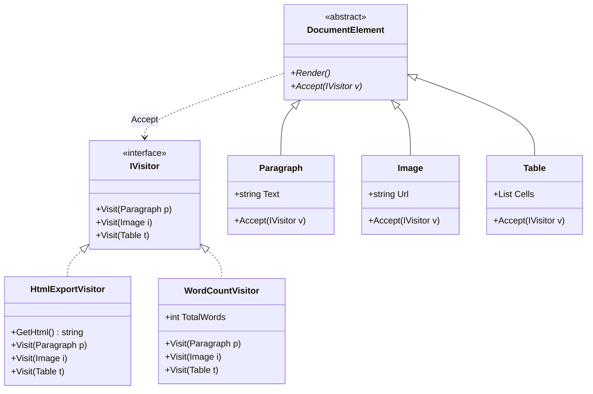

# Desafio CarnaCode 2026 - Refatoração com Visitor Pattern

Este projeto demonstra a refatoração de um sistema de documentos (Parágrafo, Imagem, Tabela) para resolver problemas de violação do Princípio Aberto/Fechado (OCP) e acoplamento excessivo de algoritmos em classes de dados.

## 🎨 Design Pattern Utilizado: Visitor

O padrão **Visitor** foi escolhido para separar os algoritmos da estrutura de objetos onde eles operam. Ele permite adicionar novas operações (como exportar para Markdown, SEO, etc.) sem modificar as classes dos elementos do documento.

### Benefícios Alcançados:
- **Separação de Preocupações**: A lógica de exportação, contagem e validação foi extraída das classes de domínio.
- **Double Dispatch**: Eliminação de verificações de tipo (`is`/`as`) e `switch cases` complexas.
- **Extensibilidade**: Facilidade em criar novos visitantes sem tocar no código existente.

## 📊 Diagrama de Classes



## 📂 Estrutura do Projeto

A solução foi organizada na pasta `src/` com cada classe em seu próprio arquivo:

- **Infraestrutura**:
  - `VisitorChallenge.csproj`: Configuração do projeto .NET 10.
  - `Program.cs`: Ponto de entrada com executor comparativo.
  - `Challenge.cs`: Versão legada preservada para referência.
- **Core do Padrão**:
  - `IVisitor.cs`: Interface definindo o contrato de visita.
  - `DocumentElement.cs`: Classe base abstrata para elementos.
- **Elementos de Domínio**:
  - `Paragraph.cs`, `Image.cs`, `Table.cs`, `Document.cs`.
- **Visitantes (Operações)**:
  - `HtmlExportVisitor.cs`: Exportação HTML.
  - `PdfExportVisitor.cs`: Exportação PDF.
  - `WordCountVisitor.cs`: Contagem de palavras.
  - `ValidationVisitor.cs`: Regras de validação.
  - `ReadingTimeVisitor.cs`: Cálculo de tempo de leitura.

## 🛠️ Etapas da Refatoração

1. **Configuração**: Criação do projeto .NET 10 e `Program.cs` orquestrador.
2. **Abstração**: Definição da interface `IVisitor` e base `DocumentElement`.
3. **Migração de Dados**: Extração de `Paragraph`, `Image` e `Table` para arquivos novos, removendo seus métodos de lógica.
4. **Implementação de Visitors**: Criação iterativa de cada visitor replicando a funcionalidade do sistema legado.
5. **Integração e Teste**: Configuração do modo comparativo no `Program.cs` para validar os resultados frente à versão original.

## 🚀 Como Executar

Certifique-se de ter o SDK do .NET 10 instalado.

```bash
dotnet run --project src/VisitorChallenge.csproj
```
