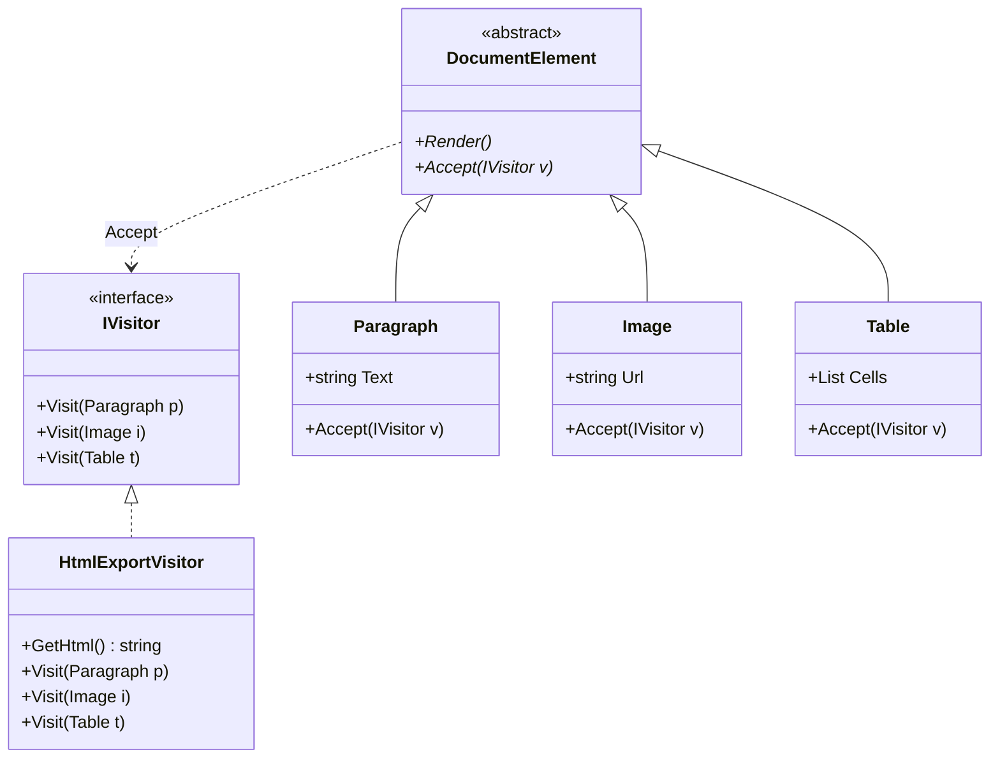

## 🥁 CarnaCode 2026 - Desafio 23 - Visitor

Oi, eu sou o Ronaldo e este é o espaço onde compartilho minha jornada de aprendizado durante o desafio **CarnaCode 2026**, realizado pelo [balta.io](https://balta.io). 👻

Aqui você vai encontrar projetos, exercícios e códigos que estou desenvolvendo durante o desafio. O objetivo é colocar a mão na massa, testar ideias e registrar minha evolução no mundo da tecnologia.

### Sobre este desafio
No desafio **Visitor** eu tive que resolver um problema real implementando o **Design Pattern** em questão.
Neste processo eu aprendi:
* ✅ Boas Práticas de Software
* ✅ Código Limpo
* ✅ SOLID
* ✅ Design Patterns (Padrões de Projeto)

## Problema
Um sistema de documentos tem diferentes tipos de elementos (Parágrafo, Imagem, Tabela) e precisa realizar múltiplas operações (exportar HTML, PDF, contar palavras, validar). 
O código atual adiciona cada operação como método em cada classe, violando Open/Closed Principle.

## Sobre o CarnaCode 2026
O desafio **CarnaCode 2026** consiste em implementar todos os 23 padrões de projeto (Design Patterns) em cenários reais. Durante os 23 desafios desta jornada, os participantes são submetidos ao aprendizado e prática na idetinficação de códigos não escaláveis e na solução de problemas utilizando padrões de mercado.

### eBook - Fundamentos dos Design Patterns
Minha principal fonte de conhecimento durante o desafio foi o eBook gratuito [Fundamentos dos Design Patterns](https://lp.balta.io/ebook-fundamentos-design-patterns).

### Veja meu progresso no desafio
[Repositório central](https://github.com/ronaldofas/balta-desafio-carnacode-2026-central)

---

# 🚀 Solução da Refatoração (Design Pattern Visitor)

Como consultor de engenharia, apliquei o padrão **Visitor** para desacoplar as operações da estrutura de dados.

## 📊 Diagrama de Classes



## 📂 Estrutura de Arquivos
Todos os arquivos estão localizados na pasta `src/`:

- `IVisitor.cs`: Contrato do Visitante.
- `DocumentElement.cs`: Base para os elementos.
- `Paragraph.cs`, `Image.cs`, `Table.cs`, `Document.cs`: Modelos de dados.
- `HtmlExportVisitor.cs`, `PdfExportVisitor.cs`, `WordCountVisitor.cs`, `ValidationVisitor.cs`, `ReadingTimeVisitor.cs`: Implementações de operações.
- `Program.cs`: Executor que compara a versão legada e a nova.
- `VisitorChallenge.csproj`: Projeto .NET 10.

## 🛠️ Etapas da Refatoração
1. **Configuração**: Criação do novo projeto e executor comparativo.
2. **Separação**: Extração das classes de dados para arquivos individuais.
3. **Infraestrutura**: Implementação da interface `IVisitor` e do método `Accept`.
4. **Implementação**: Criação dos Visitors para cada funcionalidade original.
5. **Validação**: Execução automatizada para garantir que o comportamento foi preservado.

## Como Executar
```bash
dotnet run --project src/VisitorChallenge.csproj
```
